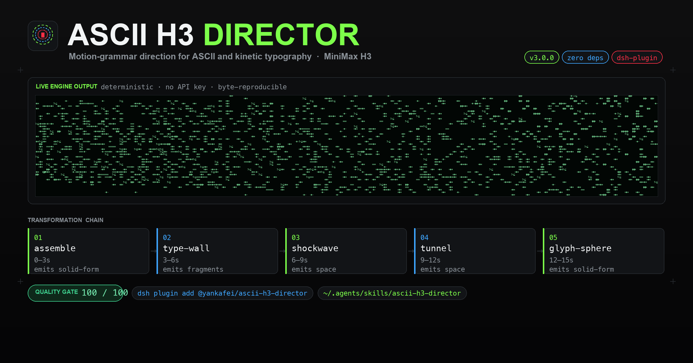
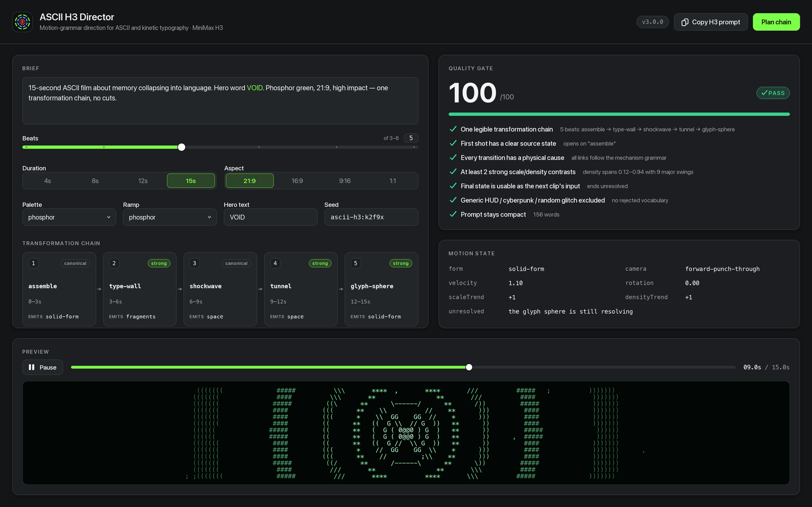
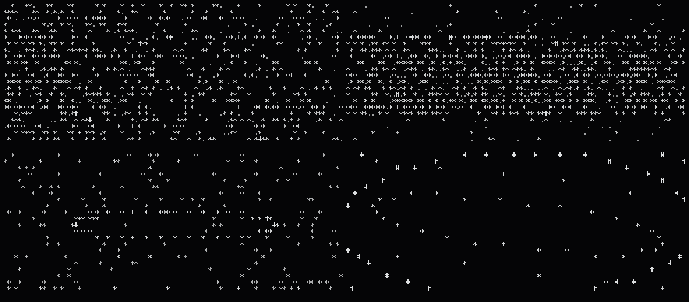
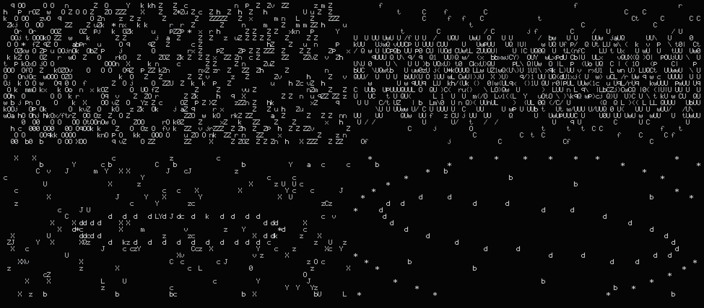
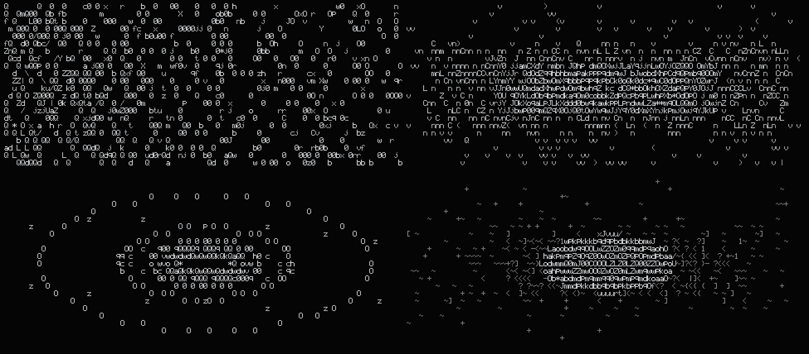

# ASCII H3 Director

[](LICENSE)
[](https://nodejs.org)
[](#requirements)
[](https://github.com/deepseek-ai/deepseek-harness)
[](#install)
[](https://github.com/MiniMax-AI/MiniMax-H3)

**中文** · [日本語](#日本語) · [English](#english)

---

## 中文

> 把一个念头，逼成一条会变形的字符链。



### 这是什么

ASCII H3 Director 是一个为 MiniMax H3 服务的导演工具：它把一句自由描述，编译成一条**变形链**（transformation chain）、一份写给时间而非散文的紧凑提示词，以及一套可在付款前拦下你的质量闸门。同时它自带一个确定性的 ASCII 渲染引擎——不联网、不调用任何图像库，用 5×9 手工点阵字库把同一份 FilmSpec 渲染成逐字节可复现的终端帧、SVG、PNG 和接触印样。它既是 **DeepSeek Harness（DSH）插件**，也是一个可移植的 **Agent Skill**。

### v3 新增了什么（对比 v1）

v1 是一份 Markdown 技能包加几个 bash 脚本：`generate_h3.sh` 转发给 `mmx video generate`，`continue_from_last_frame.sh` 用 ffmpeg 抽出上一段视频的最后一帧，`make_contact_sheet.sh` 用 ffmpeg 的 `tile` 滤镜拼印样，导演逻辑全部写在 `SKILL.md` 的散文规则里。它能用，但所有判断都靠模型自觉，所有画面都要先付钱才能看见。

| 能力 | v1 | v3 |
| --- | --- | --- |
| 形态 | Markdown + bash 包装脚本 | 8 个零依赖 ES 模块 + DSH 插件 + Agent Skill |
| 看到画面 | 必须先花钱生成，再用 ffmpeg 抽帧 | 确定性预览引擎，零 API key 即可看片 |
| 字库 | 无（依赖终端字体） | 手写 5×9 点阵，覆盖可打印 ASCII 全部 95 个字形 |
| 可复现性 | 无保证 | 种子驱动，同一 FilmSpec 两次渲染 SHA-256 完全一致（已实测） |
| 运动逻辑 | 散文规则，靠自觉 | 21 条机制的语法库 + `FORM_SUCCESSORS` 合法后继表 |
| 衔接 | "保留上一帧的运动" | 连续性契约：`exit_state` → `entry_state` 继承 + `checkSeam` 校验 |
| 质量把关 | 6 条自问自答 | 7 项检查自动打分 `/100`，不过闸门不生成 |
| 参考片分析 | "提取运动语法"（人工） | `reference` 子命令：从观测 JSON 反推 STYLE DNA 与链条 |
| 印样 | ffmpeg 必需 | 内置 PNG 编码器 + SVG 接触印样，**不需要 ffmpeg** |
| 载体 | 只要支持 SKILL.md | DSH Cordis 插件（宿主工具 + Director Console 面板） |
| 文档 | 英文 | 中 / 日 / 英 三语 |

### 安装

**路径 A — DSH 插件**

```bash
# 从 npm
dsh plugin --profile web add @yankafei/ascii-h3-director

# 或从本地路径（开发时）
dsh plugin --profile web add /Users/coffee/Desktop/创造一切可能/ascii-h3-director
```

装好后插件会向会话注册宿主工具，并在 Web UI 里挂上 **Director Console** 面板。

**路径 B — 通用 Agent Skill**

```bash
# 方法一：手动拷贝
mkdir -p ~/.agents/skills
cp -R skill ~/.agents/skills/ascii-h3-director

# 方法二：跑安装脚本
skill/INSTALL.command
```

脚本会把 `skill/` 复制到 `~/.agents/skills/ascii-h3-director/` 并打印自检命令。两条路径互不冲突：插件给 DSH，Skill 给任何读 `SKILL.md` 的编码代理。

### 快速上手

以下全部是真实可复制的终端记录；这个阶段不需要 API key，也不花一分钱。

```console
$ ascii-h3 doctor
ascii-h3-director v3.0.0

[ok] node                         v24.19.0
[ok] engine modules               8 ramps, 5 palettes
[ok] glyph atlas                  5×9 bitmap font, printable ASCII
[ok] mechanisms                   21 mechanisms in the grammar
[ok] png encoder                  built-in, no image library required
[ok] render smoke test            376 cells in 4ms
[ok] quality gate                 score 100/100
[ok] mmx-cli (paid generation)    not installed — optional; install with: npm i -g mmx-cli

all core checks passed

$ ascii-h3 plan "15s ASCII clip about memory collapsing into language"
TITLE      15s / ascii / memory / collapsing
SEED       ascii-h3:1wok55r
DURATION   15s @ 21:9
LOOK       brutalist-digital / brutalist / high-impact
HERO TEXT  —

TRANSFORMATION CHAIN
   1. 0–3s       Assemble from Sparse Field  [canonical]
      characters converge along their own velocity vectors until a solid form snaps into legibility
      exit → form=solid-form camera=forward-punch-through v=1
   2. 3–6s       Typographic Wall  [strong]
      the camera punches through each wall without cutting; the wall shatters from the point of impact outward
      exit → form=fragments camera=forward-punch-through v=1
   ...

QUALITY GATE  PASS  (100/100)
────────────────────────────────────────────────────────────────
  ✔ One legible transformation chain
      5 beat(s): assemble → type-wall → shockwave → tunnel → glyph-sphere
  ✔ First shot has a clear source state
      opens on "assemble"
  ✔ Every transition has a physical cause

$ ascii-h3 preview "a brutalist ASCII tunnel collapsing into a giant word OPEN" --cols 100 --rows 24
    GG   ##      G ##G GG   G ##G        ##  G       ##
 G C      GC G G    G  C G  G0        C C G G
  G         C  G    G     GC G               GC   GC
G      0   CG    C     C0  000   GG               C  C GG  G
CG      C                 8   8 C   G GGGG C  GC        C G
 CC        C     C   #####8 ##8#G########   C           0
C    G    ################8 ##8# ########## ######## GG   C
         ############    G8   8     G    ## #########   G G
  ... (24 rows of deterministic glyphs)

$ ascii-h3 strip "brutalist ASCII tunnel into giant word OPEN" --frames 6 --out sheet.png
wrote sheet.png (6 frames, 600×1788)
```

把 `--cols/--rows` 调小可以先在终端里构图，再放大出图；`--out` 换成 `.svg` 就得到矢量印样。

**唯一花钱的一步**（必须闸门先 PASS）：

```bash
# 1. 写出提示词
ascii-h3 prompt "15s ASCII clip about memory collapsing into language" --out prompt.txt

# 2. 生成（H3 是付费服务；仓库里唯一会产生费用的调用）
mmx video generate --model MiniMax-H3 --prompt "$(cat prompt.txt)" \
  --duration 15 --ratio 21:9 --download outputs/clip01.mp4
```

`mmx` 未安装时，`doctor` 会把它标为可选而不是失败——引擎本身从不依赖它。

### 命令参考

| 命令 | 参数 | 作用 |
| --- | --- | --- |
| `plan` | `"<brief>" [--seed S] [--beats N] [--json]` | 完整导演方案：变形链、每拍运动状态、质量闸门 |
| `chain` | `"<brief>" [--beats N] [--json]` | 只输出变形链 |
| `prompt` | `"<brief>" [--out FILE]` | 只输出紧凑的 H3 提示词 |
| `review` | `["<brief>"] [--out prompt.txt] [--json]` | 单独跑质量闸门；`--out` 可让闸门审查已有提示词 |
| `reference` | `<obs.json> [--json]` | 从参考片观测 JSON 提取 STYLE DNA 与可复现的运动链 |
| `continue` | `<exit-state.json> "<brief>" [--json]` | 规划无缝续集：继承上一段出口状态，并报告接缝违规 |
| `preview` | `"<brief>" [--t SEC] [--cols N] [--rows N]` | 在终端打印单帧 ASCII |
| `svg` | `"<brief>" --t SEC --out FILE.svg` | 导出矢量帧 |
| `png` | `"<brief>" --t SEC --out FILE.png` | 导出位图帧（内置编码器） |
| `strip` | `"<brief>" [--frames N] [--cols N] [--rows N] --out FILE.png\|.svg` | 接触印样：N 张等距帧拼成一张图，不需要 ffmpeg |
| `mechanisms` | `[--json]` | 打印运动语法库（按层级分组） |
| `doctor` | — | 自检并跑一次渲染冒烟测试 |
| `help` / `version` | — | 用法 / 版本 |

通用标志：`--seed --beats --duration --ratio --palette --ramp --mode --text "WORD,WORD" --avoid "a,b" --allow --block`，另加渲染用的 `--t --cols --rows --cellW --cellH`。

可选值：`--ramp` ∈ `classic brutalist minimal operators binary data phosphor typographic`；`--palette` ∈ `brutalist-digital minimal-signal phosphor paper-terminal monolith`；`--mode` ∈ `high-impact minimal-data`；`--ratio` ∈ `21:9 16:9 9:16 4:3 1:1 adaptive`。

### 运动语法

一条片子不是一种"风格"，而是一条**变形链**：字随时间改变职能——文字变成图案，图案变成粒子，粒子变成几何，几何变成空间，空间再变回文字。语法库共 21 条机制，分四层。

| 层级 | id | 名称 | 留下什么（emits） |
| --- | --- | --- | --- |
| canonical | `assemble` | Assemble from Sparse Field | `solid-form` |
| canonical | `density-dissolve` | Density Dissolve | `field` |
| canonical | `structural-decay` | Structural Decay | `fragments` |
| canonical | `letter-fragmentation` | Diegetic Letter-Topology Fragmentation | `fragments` |
| canonical | `implosion` | Implosion | `void` |
| canonical | `shockwave` | Command Shockwave | `space` |
| canonical | `cursor-vortex` | Cursor Vortex | `void` |
| strong | `boot-signal` | Boot Signal | `letterform` |
| strong | `contour-migration` | Contour Migration | `solid-form` |
| strong | `tunnel` | ASCII Tunnel | `space` |
| strong | `type-wall` | Typographic Wall | `fragments` |
| strong | `glyph-sphere` | Glyph Sphere | `solid-form` |
| strong | `giant-word` | Giant Cropped Typography | `letterform` |
| strong | `spatial-fold` | Spatial Fold | `space` |
| support | `field` | Character Field | `field` |
| support | `mask` | Text Mask | `letterform` |
| reject | `reject-hud` | Decorative HUD | `cliche` |
| reject | `reject-city` | Generic Cyberpunk City | `cliche` |
| reject | `reject-glitch` | Meaningless Glitch | `cliche` |
| reject | `reject-particles` | Unmotivated Particles | `cliche` |
| reject | `reject-smoke` | Smoke / Liquid Wipe | `cliche` |

`reject` 层故意留在语法库里——审查器需要能**说出**失败的名字，而不是只说"不好"。合法后继由 `FORM_SUCCESSORS` 决定，例如 `solid-form → density-dissolve | contour-migration | implosion | type-wall`，`space → type-wall | tunnel | spatial-fold | glyph-sphere`。

### 连续性契约

续集不是新场景。上一段的 `exit_state` 会**成为**下一段的 `entry_state`——摄影机向量、表观速度、旋转、缩放趋势、密度趋势、调色板、字符集全部继承，只有未完成的动作被移交而不是重新声明。

非法示例（摄影机复位 + 调色板跳变 + 速度归零，`checkSeam` 会逐条报出）：

```diff
  // exit_state.json（上一段出口）
  { "form": "solid-form", "camera": "forward-punch-through",
-   "velocity": 1.1, "palette": "brutalist-digital", "ramp": "brutalist",
-   "unresolved": "the glyph sphere is still resolving when the clip ends" }
  // entry_state（续集开头）——错误
+ { "form": "void", "camera": "orbital-lock",
+   "velocity": 0, "palette": "phosphor", "ramp": "minimal",
+   "unresolved": "the glyph sphere is still resolving when the clip ends" }
```

修正后（`inherit()` 的产物，`checkSeam` 返回空数组）：

```json
{
  "form": "solid-form",
  "camera": "forward-punch-through",
  "velocity": 1.21,
  "rotation": 0,
  "scaleTrend": -1,
  "densityTrend": 1,
  "unresolved": "",
  "palette": "brutalist-digital",
  "ramp": "brutalist"
}
```

`checkSeam` 会检查：摄影机向量是否复位；表观速度是否被归零；速度方向是否在接缝处反转；调色板是否改变；主导字符集是否改变；未完成的动作是否被重复而不是收尾。`ascii-h3 continue` 会把违规逐条打印在 `SEAM: BROKEN` 之下；`SEAM: holds` 表示接缝成立。

### 质量闸门

付款前，7 项检查每一项都要能回答"是"。得分 = 通过数 / 7 × 100，全通过才 `PASS`。

| id | 检查 | 失败意味着 |
| --- | --- | --- |
| `single-chain` | 存在一条可读的变形链（≥3 拍） | 概念太散，先收敛成一条链 |
| `source-state` | 首镜有明确的起始状态 | 没有起点，观众不知道从哪开始 |
| `physical-cause` | 每个转场都有物理成因 | 出现了语法上没有合法后继的跳变 |
| `contrast` | 至少 2 次强烈的尺度/密度对比 | 画面平；加大压缩与释放的摆幅 |
| `exit-state` | 末态可作为下一段的输入 | 片子完全收尾，无法续接 |
| `no-cliche` | 正提示词里没有 HUD / 赛博城市 / 随机故障 | 陈词滥调混进了正向描述 |
| `compact` | 提示词保持紧凑（≤320 词） | 写给时间，而不是写给散文 |

### 界面

Director Console 把上面这一切放进 DSH Web UI：左栏是 brief 与标志，中栏是失真链条和逐拍状态，右栏是闸门分数与预览。



确定性引擎导出的接触印样与预览帧：







### 仓库结构

```
ascii-h3-director/
├── src/
│   ├── cli.js             # 命令面：13 个子命令、参数解析、doctor
│   ├── core.js            # 种子 RNG、缓动、值噪声、8 条 ramp、5 套 palette
│   ├── glyph-atlas.js     # 手写 5×9 点阵字库（ASCII 32–126，95 字形）
│   ├── renderer.js        # Grid / Camera / 图元 / planFilm / renderFilmFrame
│   ├── motion-grammar.js  # 21 条机制、FORM_SUCCESSORS、inherit / checkSeam
│   ├── director.js        # brief 解析、提示词合成、质量闸门、参考分析、续集
│   ├── raster.js          # Grid → 文本 / SVG / RGB
│   └── png.js             # 内置 PNG 编码器（zlib，无外部依赖）
├── skill/                 # 可移植 Agent Skill（SKILL.md + references + scripts）
├── docs/                  # 三语文档
├── assets/                # README 图像与印样
└── test/                  # 确定性回归测试
```

### 环境要求

- **Node 18+**（`doctor` 会显式检查主版本号）
- 引擎**零运行时依赖**：没有 `node_modules` 也能跑，PNG 由内置编码器写出
- **ffmpeg 可选**：`strip` / `preview` / `svg` / `png` 全部不需要它
- **`mmx-cli` 可选**：`npm i -g mmx-cli`，只用于付费生成

### 致谢与既有工作

- [MiniMax-AI/MiniMax-H3](https://github.com/MiniMax-AI/MiniMax-H3) — H3 模型与官方 prompt-writing 技能
- [MiniMax-AI/cli](https://github.com/MiniMax-AI/cli) — `mmx` CLI，付费生成与下载
- [mexicat/pdoom-video](https://github.com/mexicat/pdoom-video) — style bible、时间轴思维、印样式审查
- [mrdoob/three.js](https://github.com/mrdoob/three.js) — `AsciiEffect`，早期 ASCII 渲染的参考
- [remotion-dev/remotion](https://github.com/remotion-dev/remotion) — 常量优先的时序与可编程渲染流程
- [motion-canvas/motion-canvas](https://github.com/motion-canvas/motion-canvas) — 代码驱动矢量/文字动画的备选回退
- [deepseek-ai/deepseek-harness](https://github.com/deepseek-ai/deepseek-harness) — 插件、工具与面板的宿主

### 许可证

MIT。贡献请保持三语 README 同步，并让 `ascii-h3 doctor` 通过。

---

## 日本語

> ひとつの想念を、変形しつづける文字の連鎖に絞り上げる。

### これは何か

ASCII H3 Director は MiniMax H3 のための演出ツールです。自由な一行のブリーフを**変形チェーン**、時間のために書かれた簡潔なプロンプト、そして支払いの前に立ちはだかる品質ゲートへとコンパイルします。さらに決定論的な ASCII レンダリングエンジンを内蔵し、5×9 の手書きビットマップ書体だけで、同じ FilmSpec をバイト単位で再現可能な端末フレーム・SVG・PNG・コンタクトシートに描き出します。**DeepSeek Harness（DSH）プラグイン**であり、同時に可搬な **Agent Skill** でもあります。

### v3 で新しくなったこと（v1 との比較）

v1 は Markdown のスキルと bash スクリプトの集まりでした。`generate_h3.sh` は `mmx video generate` に丸投げし、`continue_from_last_frame.sh` は ffmpeg で前作の最終フレームを抜き、`make_contact_sheet.sh` は ffmpeg の `tile` フィルタでシートを組み、演出の判断はすべて `SKILL.md` の散文ルールに書かれていました。動きますが、判断はモデルの良識任せ、絵を見るにはまず支払う必要がありました。

| 能力 | v1 | v3 |
| --- | --- | --- |
| 形態 | Markdown + bash ラッパ | 依存ゼロの ES モジュール 8 本 + DSH プラグイン + Agent Skill |
| 絵を見る | 生成してから ffmpeg で抜き出す | 決定論的プレビュー。API キーなしで確認できる |
| 書体 | なし（端末フォント依存） | 手書き 5×9 ビットマップ。印字可能 ASCII 95 字形を収録 |
| 再現性 | 保証なし | シード駆動。同一 FilmSpec の 2 回レンダリングが SHA-256 一致（実測済み） |
| 運動の論理 | 散文のルール | 21 機構の文法ライブラリ + `FORM_SUCCESSORS` 後継表 |
| 接続 | 「前フレームの運動を保つ」 | 連続性契約：`exit_state` → `entry_state` 継承 + `checkSeam` 検証 |
| 品質 | 6 つの自問 | 7 項目を自動採点（/100）。合格しないと生成しない |
| 参照分析 | 「運動文法を抽出」（手作業） | `reference` サブコマンド：観測 JSON から STYLE DNA とチェーンを逆算 |
| コンタクトシート | ffmpeg 必須 | 内蔵 PNG エンコーダ + SVG シート。**ffmpeg 不要** |
| 配布 | SKILL.md が読めれば可 | DSH Cordis プラグイン（ホストツール + Director Console パネル） |
| ドキュメント | 英語 | 中 / 日 / 英 の三言語 |

### インストール

**経路 A — DSH プラグイン**

```bash
# npm から
dsh plugin --profile web add @yankafei/ascii-h3-director

# ローカルパスから（開発時）
dsh plugin --profile web add /Users/coffee/Desktop/创造一切可能/ascii-h3-director
```

導入後、プラグインはセッションにホストツールを登録し、Web UI に **Director Console** パネルを載せます。

**経路 B — 汎用 Agent Skill**

```bash
# 手動コピー
mkdir -p ~/.agents/skills
cp -R skill ~/.agents/skills/ascii-h3-director

# またはインストーラ
skill/INSTALL.command
```

`skill/` が `~/.agents/skills/ascii-h3-director/` にコピーされ、自己検証コマンドが表示されます。2 つの経路は競合しません。プラグインは DSH に、Skill は `SKILL.md` を読むあらゆるコーディングエージェントに。

### クイックスタート

以下はすべて実際に実行できるターミナル記録です。この段階で API キーは不要、費用もゼロです。

```console
$ ascii-h3 doctor
ascii-h3-director v3.0.0

[ok] node                         v24.19.0
[ok] engine modules               8 ramps, 5 palettes
[ok] glyph atlas                  5×9 bitmap font, printable ASCII
[ok] mechanisms                   21 mechanisms in the grammar
[ok] png encoder                  built-in, no image library required
[ok] render smoke test            376 cells in 4ms
[ok] quality gate                 score 100/100
[ok] mmx-cli (paid generation)    not installed — optional; install with: npm i -g mmx-cli

all core checks passed

$ ascii-h3 plan "15s ASCII clip about memory collapsing into language"
TITLE      15s / ascii / memory / collapsing
SEED       ascii-h3:1wok55r
DURATION   15s @ 21:9
LOOK       brutalist-digital / brutalist / high-impact
HERO TEXT  —

TRANSFORMATION CHAIN
   1. 0–3s       Assemble from Sparse Field  [canonical]
      characters converge along their own velocity vectors until a solid form snaps into legibility
      exit → form=solid-form camera=forward-punch-through v=1
   2. 3–6s       Typographic Wall  [strong]
      the camera punches through each wall without cutting; the wall shatters from the point of impact outward
      exit → form=fragments camera=forward-punch-through v=1
   ...

QUALITY GATE  PASS  (100/100)
────────────────────────────────────────────────────────────────
  ✔ One legible transformation chain
      5 beat(s): assemble → type-wall → shockwave → tunnel → glyph-sphere
  ✔ First shot has a clear source state
      opens on "assemble"
  ✔ Every transition has a physical cause

$ ascii-h3 preview "a brutalist ASCII tunnel collapsing into a giant word OPEN" --cols 100 --rows 24
    GG   ##      G ##G GG   G ##G        ##  G       ##
 G C      GC G G    G  C G  G0        C C G G
  G         C  G    G     GC G               GC   GC
G      0   CG    C     C0  000   GG               C  C GG  G
CG      C                 8   8 C   G GGGG C  GC        C G
 CC        C     C   #####8 ##8#G########   C           0
C    G    ################8 ##8# ########## ######## GG   C
         ############    G8   8     G    ## #########   G G
  ... （24 行の決定論的なグリフ）

$ ascii-h3 strip "brutalist ASCII tunnel into giant word OPEN" --frames 6 --out sheet.png
wrote sheet.png (6 frames, 600×1788)
```

`--cols/--rows` を小さくすれば端末で構図を確認でき、`--out` を `.svg` にすればベクターのシートになります。

**唯一お金がかかる段階**（ゲートが PASS していることが前提）:

```bash
# 1. プロンプトを書き出す
ascii-h3 prompt "15s ASCII clip about memory collapsing into language" --out prompt.txt

# 2. 生成（H3 は有償サービス。課金を伴う呼び出しはこの一手順だけ）
mmx video generate --model MiniMax-H3 --prompt "$(cat prompt.txt)" \
  --duration 15 --ratio 21:9 --download outputs/clip01.mp4
```

`mmx` が無くても `doctor` は「任意」と報告するだけで失敗にはしません。エンジンはそれに依存しません。

### コマンドリファレンス

| コマンド | 引数 | 動作 |
| --- | --- | --- |
| `plan` | `"<brief>" [--seed S] [--beats N] [--json]` | 演出の全体像：変形チェーン、各拍の運動状態、品質ゲート |
| `chain` | `"<brief>" [--beats N] [--json]` | 変形チェーンのみ |
| `prompt` | `"<brief>" [--out FILE]` | 簡潔な H3 プロンプトのみ |
| `review` | `["<brief>"] [--out prompt.txt] [--json]` | 品質ゲートのみ実行。`--out` で既存プロンプトを審査 |
| `reference` | `<obs.json> [--json]` | 参照映像の観測 JSON から STYLE DNA と運動チェーンを抽出 |
| `continue` | `<exit-state.json> "<brief>" [--json]` | 継ぎ目のない続編を設計。前作の出口状態を継承し、違反を報告 |
| `preview` | `"<brief>" [--t SEC] [--cols N] [--rows N]` | 1 フレームを端末に印字 |
| `svg` | `"<brief>" --t SEC --out FILE.svg` | ベクター 1 フレームを書き出し |
| `png` | `"<brief>" --t SEC --out FILE.png` | ラスター 1 フレームを書き出し（内蔵エンコーダ） |
| `strip` | `"<brief>" [--frames N] [--cols N] [--rows N] --out FILE.png\|.svg` | 等間隔 N フレームのコンタクトシート。ffmpeg 不要 |
| `mechanisms` | `[--json]` | 運動文法を階層ごとに表示 |
| `doctor` | — | 自己診断とレンダリングのスモークテスト |
| `help` / `version` | — | 使い方 / バージョン |

共通フラグ：`--seed --beats --duration --ratio --palette --ramp --mode --text "WORD,WORD" --avoid "a,b" --allow --block`、描画用に `--t --cols --rows --cellW --cellH`。

選択肢：`--ramp` ∈ `classic brutalist minimal operators binary data phosphor typographic`、`--palette` ∈ `brutalist-digital minimal-signal phosphor paper-terminal monolith`、`--mode` ∈ `high-impact minimal-data`、`--ratio` ∈ `21:9 16:9 9:16 4:3 1:1 adaptive`。

### 運動文法

作品は「スタイル」ではなく**変形チェーン**です。文字は時間とともに機能を変えます。文字が模様になり、模様が粒子になり、粒子が幾何になり、幾何が空間になり、空間がまた文字へ戻る。文法ライブラリは 21 の機構を 4 階層に分けます。

| 階層 | id | 名称 | 残すもの（emits） |
| --- | --- | --- | --- |
| canonical | `assemble` | Assemble from Sparse Field | `solid-form` |
| canonical | `density-dissolve` | Density Dissolve | `field` |
| canonical | `structural-decay` | Structural Decay | `fragments` |
| canonical | `letter-fragmentation` | Diegetic Letter-Topology Fragmentation | `fragments` |
| canonical | `implosion` | Implosion | `void` |
| canonical | `shockwave` | Command Shockwave | `space` |
| canonical | `cursor-vortex` | Cursor Vortex | `void` |
| strong | `boot-signal` | Boot Signal | `letterform` |
| strong | `contour-migration` | Contour Migration | `solid-form` |
| strong | `tunnel` | ASCII Tunnel | `space` |
| strong | `type-wall` | Typographic Wall | `fragments` |
| strong | `glyph-sphere` | Glyph Sphere | `solid-form` |
| strong | `giant-word` | Giant Cropped Typography | `letterform` |
| strong | `spatial-fold` | Spatial Fold | `space` |
| support | `field` | Character Field | `field` |
| support | `mask` | Text Mask | `letterform` |
| reject | `reject-hud` | Decorative HUD | `cliche` |
| reject | `reject-city` | Generic Cyberpunk City | `cliche` |
| reject | `reject-glitch` | Meaningless Glitch | `cliche` |
| reject | `reject-particles` | Unmotivated Particles | `cliche` |
| reject | `reject-smoke` | Smoke / Liquid Wipe | `cliche` |

`reject` 階層はあえて文法に残しています。レビュアーが失敗に**名前を与えられる**必要があるからです。合法な後続は `FORM_SUCCESSORS` が決めます（例：`solid-form → density-dissolve | contour-migration | implosion | type-wall`、`space → type-wall | tunnel | spatial-fold | glyph-sphere`）。

### 連続性契約

続編は新しい場面ではありません。前作の `exit_state` が次作の `entry_state` に**なる**のです。カメラベクトル、見かけの速度、回転、スケール傾向、密度傾向、パレット、文字集合がすべて継承され、未解決の動作だけが再宣言ではなく引き継がれます。

違反例（カメラのリセット + パレット変更 + 速度ゼロ。`checkSeam` が項目ごとに報告します）:

```diff
  // exit_state.json（前作の出口）
  { "form": "solid-form", "camera": "forward-punch-through",
-   "velocity": 1.1, "palette": "brutalist-digital", "ramp": "brutalist",
-   "unresolved": "the glyph sphere is still resolving when the clip ends" }
  // entry_state（続編の入口）—— 誤り
+ { "form": "void", "camera": "orbital-lock",
+   "velocity": 0, "palette": "phosphor", "ramp": "minimal",
+   "unresolved": "the glyph sphere is still resolving when the clip ends" }
```

修正後（`inherit()` の出力。`checkSeam` は空配列を返します）:

```json
{
  "form": "solid-form",
  "camera": "forward-punch-through",
  "velocity": 1.21,
  "rotation": 0,
  "scaleTrend": -1,
  "densityTrend": 1,
  "unresolved": "",
  "palette": "brutalist-digital",
  "ramp": "brutalist"
}
```

`checkSeam` が検査するのは：カメラベクトルのリセット、見かけの速度のゼロ落ち、継ぎ目での速度方向の反転、パレットの変化、主導文字集合の変化、未解決動作の反復。`ascii-h3 continue` は違反を `SEAM: BROKEN` の下に列挙し、`SEAM: holds` なら継ぎ目は成立しています。

### 品質ゲート

支払いの前に 7 項目すべてに「はい」と答えられる必要があります。得点は通過数 / 7 × 100、全通過で `PASS`。

| id | 検査 | 落ちたときの意味 |
| --- | --- | --- |
| `single-chain` | 読める変形チェーンが 1 本ある（3 拍以上） | 概念が散っている。まず 1 本に絞る |
| `source-state` | 最初のショットに明白な初期状態がある | 起点がなく、観客が迷う |
| `physical-cause` | すべての転換に物理的な原因がある | 文法上、合法な後続でない繋ぎがある |
| `contrast` | 強い尺度/密度の対比が 2 回以上 | 画面が平坦。圧縮と解放の振り幅を上げる |
| `exit-state` | 最終状態を次作の入力にできる | 完全に収束しており続けられない |
| `no-cliche` | 肯定プロンプトに HUD / サイバー都市 / ランダムグリッチがない | 陳腐な語彙が肯定側に混入している |
| `compact` | プロンプトが簡潔（320 語以下） | 散文ではなく時間のために書く |

### インターフェース

Director Console はこのすべてを DSH Web UI に載せます。左にブリーフとフラグ、中央に変形チェーンと各拍の状態、右にゲートの得点とプレビュー。


決定論的エンジンが出力するコンタクトシートとプレビュー:


### リポジトリ構成

```
ascii-h3-director/
├── src/
│   ├── cli.js             # コマンド面：13 サブコマンド、引数解析、doctor
│   ├── core.js            # シード RNG、イージング、値ノイズ、8 ランプ、5 パレット
│   ├── glyph-atlas.js     # 手書き 5×9 ビットマップ書体（ASCII 32–126、95 字形）
│   ├── renderer.js        # Grid / Camera / プリミティブ / planFilm / renderFilmFrame
│   ├── motion-grammar.js  # 21 機構、FORM_SUCCESSORS、inherit / checkSeam
│   ├── director.js        # ブリーフ解析、プロンプト合成、品質ゲート、参照分析、続編
│   ├── raster.js          # Grid → テキスト / SVG / RGB
│   └── png.js             # 内蔵 PNG エンコーダ（zlib のみ、外部依存なし）
├── skill/                 # 可搬 Agent Skill（SKILL.md + references + scripts）
├── docs/                  # 三言語ドキュメント
├── assets/                # README 画像とコンタクトシート
└── test/                  # 決定論の回帰テスト
```

### 動作要件

- **Node 18+**（`doctor` がメジャー版を明示的に検査）
- エンジンの**ランタイム依存はゼロ**。`node_modules` なしで動き、PNG は内蔵エンコーダが書きます
- **ffmpeg は任意**：`strip` / `preview` / `svg` / `png` はいずれも不要
- **`mmx-cli` は任意**：`npm i -g mmx-cli`、有償生成のみに使用

### クレジットと先行事例

- [MiniMax-AI/MiniMax-H3](https://github.com/MiniMax-AI/MiniMax-H3) — H3 モデルと公式 prompt-writing スキル
- [MiniMax-AI/cli](https://github.com/MiniMax-AI/cli) — `mmx` CLI（有償生成とダウンロード）
- [mexicat/pdoom-video](https://github.com/mexicat/pdoom-video) — スタイルバイブル、タイムライン思考、シートレビュー
- [mrdoob/three.js](https://github.com/mrdoob/three.js) — `AsciiEffect`。初期 ASCII レンダリングの参照
- [remotion-dev/remotion](https://github.com/remotion-dev/remotion) — 定数優先のタイミングとプログラマブルな描画
- [motion-canvas/motion-canvas](https://github.com/motion-canvas/motion-canvas) — コード駆動のベクター/文字アニメの代替
- [deepseek-ai/deepseek-harness](https://github.com/deepseek-ai/deepseek-harness) — プラグイン、ツール、パネルのホスト

### ライセンス

MIT。貢献の際は三言語 README を同期させ、`ascii-h3 doctor` を通してください。

---

## English

> Force one idea into a chain of characters that will not stop changing shape.

### What it is

ASCII H3 Director is a directing tool for MiniMax H3. It compiles a free-form brief into a **transformation chain**, a prompt written for time rather than prose, and a quality gate that stands between you and the pay button. It also ships a deterministic ASCII render engine: a 5×9 hand-authored bitmap font that turns the same FilmSpec into byte-reproducible terminal frames, SVGs, PNGs, and contact sheets. It is both a **DeepSeek Harness (DSH) plugin** and a portable **Agent Skill**.

### What's new in v3 (against v1)

v1 was a Markdown skill plus bash scripts. `generate_h3.sh` forwarded to `mmx video generate`, `continue_from_last_frame.sh` used ffmpeg to pull the last frame of the previous clip, `make_contact_sheet.sh` tiled frames through an ffmpeg filter, and every directorial rule lived as prose inside `SKILL.md`. It worked — but the judgement was on the model's honour, and you had to pay before you could see a single frame.

| Capability | v1 | v3 |
| --- | --- | --- |
| Shape | Markdown + bash wrappers | 8 zero-dependency ES modules + DSH plugin + Agent Skill |
| Seeing the frame | Generate first, then extract with ffmpeg | Deterministic preview engine — no API key required |
| Type | None (terminal font) | Hand-authored 5×9 bitmap covering all 95 printable ASCII glyphs |
| Reproducibility | Unspecified | Seeded; two renders of one FilmSpec matched SHA-256 (measured) |
| Motion logic | Prose rules | 21-mechanism grammar library + a `FORM_SUCCESSORS` legality table |
| Continuation | "preserve the previous motion" | Continuity contract: `exit_state` → `entry_state` + `checkSeam` |
| Quality | 6 self-directed questions | 7 automated checks scored /100; no PASS, no generation |
| Reference analysis | "extract the motion grammar" (manual) | `reference` subcommand: STYLE DNA and chain inferred from observations |
| Contact sheet | ffmpeg required | Built-in PNG encoder + SVG sheets, **no ffmpeg** |
| Delivery | Anything that reads SKILL.md | DSH Cordis plugin with host tools and a Director Console panel |
| Docs | English | Chinese / Japanese / English |

### Install

**Path A — DSH plugin**

```bash
# from npm
dsh plugin --profile web add @yankafei/ascii-h3-director

# or from a local path (development)
dsh plugin --profile web add /Users/coffee/Desktop/创造一切可能/ascii-h3-director
```

Once installed, the plugin registers its host tools with the session and mounts the **Director Console** panel in the Web UI.

**Path B — generic Agent Skill**

```bash
# copy by hand
mkdir -p ~/.agents/skills
cp -R skill ~/.agents/skills/ascii-h3-director

# or run the installer
skill/INSTALL.command
```

The installer copies `skill/` to `~/.agents/skills/ascii-h3-director/` and prints the self-check command. The two paths do not conflict: the plugin serves DSH, the skill serves any coding agent that reads `SKILL.md`.

### Quick start

Everything below is a real, copy-pasteable transcript. No API key, no cost.

```console
$ ascii-h3 doctor
ascii-h3-director v3.0.0

[ok] node                         v24.19.0
[ok] engine modules               8 ramps, 5 palettes
[ok] glyph atlas                  5×9 bitmap font, printable ASCII
[ok] mechanisms                   21 mechanisms in the grammar
[ok] png encoder                  built-in, no image library required
[ok] render smoke test            376 cells in 4ms
[ok] quality gate                 score 100/100
[ok] mmx-cli (paid generation)    not installed — optional; install with: npm i -g mmx-cli

all core checks passed

$ ascii-h3 plan "15s ASCII clip about memory collapsing into language"
TITLE      15s / ascii / memory / collapsing
SEED       ascii-h3:1wok55r
DURATION   15s @ 21:9
LOOK       brutalist-digital / brutalist / high-impact
HERO TEXT  —

TRANSFORMATION CHAIN
   1. 0–3s       Assemble from Sparse Field  [canonical]
      characters converge along their own velocity vectors until a solid form snaps into legibility
      exit → form=solid-form camera=forward-punch-through v=1
   2. 3–6s       Typographic Wall  [strong]
      the camera punches through each wall without cutting; the wall shatters from the point of impact outward
      exit → form=fragments camera=forward-punch-through v=1
   ...

QUALITY GATE  PASS  (100/100)
────────────────────────────────────────────────────────────────
  ✔ One legible transformation chain
      5 beat(s): assemble → type-wall → shockwave → tunnel → glyph-sphere
  ✔ First shot has a clear source state
      opens on "assemble"
  ✔ Every transition has a physical cause

$ ascii-h3 preview "a brutalist ASCII tunnel collapsing into a giant word OPEN" --cols 100 --rows 24
    GG   ##      G ##G GG   G ##G        ##  G       ##
 G C      GC G G    G  C G  G0        C C G G
  G         C  G    G     GC G               GC   GC
G      0   CG    C     C0  000   GG               C  C GG  G
CG      C                 8   8 C   G GGGG C  GC        C G
 CC        C     C   #####8 ##8#G########   C           0
C    G    ################8 ##8# ########## ######## GG   C
         ############    G8   8     G    ## #########   G G
  ... (24 rows of deterministic glyphs)

$ ascii-h3 strip "brutalist ASCII tunnel into giant word OPEN" --frames 6 --out sheet.png
wrote sheet.png (6 frames, 600×1788)
```

Drop `--cols/--rows` to compose in the terminal first, then raise them for the final image; point `--out` at a `.svg` to get a vector sheet.

**The one step that costs money** (and it is gated on the quality gate):

```bash
# 1. write the prompt
ascii-h3 prompt "15s ASCII clip about memory collapsing into language" --out prompt.txt

# 2. generate (H3 is a paid service; this is the only billable call in the repo)
mmx video generate --model MiniMax-H3 --prompt "$(cat prompt.txt)" \
  --duration 15 --ratio 21:9 --download outputs/clip01.mp4
```

With `mmx` absent, `doctor` reports it as optional rather than failing — the engine never depends on it.

### Command reference

| Command | Arguments | What it does |
| --- | --- | --- |
| `plan` | `"<brief>" [--seed S] [--beats N] [--json]` | Full direction plan: chain, per-beat motion state, quality gate |
| `chain` | `"<brief>" [--beats N] [--json]` | Just the transformation chain |
| `prompt` | `"<brief>" [--out FILE]` | Only the compact H3 prompt |
| `review` | `["<brief>"] [--out prompt.txt] [--json]` | Run the quality gate alone; `--out` audits an existing prompt |
| `reference` | `<obs.json> [--json]` | Extract STYLE DNA and a reproducible chain from reference observations |
| `continue` | `<exit-state.json> "<brief>" [--json]` | Plan a seamless sequel inheriting the previous exit state, reporting seam violations |
| `preview` | `"<brief>" [--t SEC] [--cols N] [--rows N]` | Print one ASCII frame to the terminal |
| `svg` | `"<brief>" --t SEC --out FILE.svg` | Export one vector frame |
| `png` | `"<brief>" --t SEC --out FILE.png` | Export one raster frame via the built-in encoder |
| `strip` | `"<brief>" [--frames N] [--cols N] [--rows N] --out FILE.png\|.svg` | Contact sheet of N evenly spaced frames; no ffmpeg |
| `mechanisms` | `[--json]` | Print the motion grammar, grouped by tier |
| `doctor` | — | Self-check plus a real render smoke test |
| `help` / `version` | — | Usage / version |

Common flags: `--seed --beats --duration --ratio --palette --ramp --mode --text "WORD,WORD" --avoid "a,b" --allow --block`, plus `--t --cols --rows --cellW --cellH` for rendering.

Choices: `--ramp` ∈ `classic brutalist minimal operators binary data phosphor typographic`; `--palette` ∈ `brutalist-digital minimal-signal phosphor paper-terminal monolith`; `--mode` ∈ `high-impact minimal-data`; `--ratio` ∈ `21:9 16:9 9:16 4:3 1:1 adaptive`.

### The motion grammar

A clip is not a style; it is a **transformation chain**. Characters change function over time: text becomes pattern, pattern becomes particles, particles become geometry, geometry becomes space, space becomes typography again. The library holds 21 mechanisms across four tiers.

| Tier | id | Name | Emits |
| --- | --- | --- | --- |
| canonical | `assemble` | Assemble from Sparse Field | `solid-form` |
| canonical | `density-dissolve` | Density Dissolve | `field` |
| canonical | `structural-decay` | Structural Decay | `fragments` |
| canonical | `letter-fragmentation` | Diegetic Letter-Topology Fragmentation | `fragments` |
| canonical | `implosion` | Implosion | `void` |
| canonical | `shockwave` | Command Shockwave | `space` |
| canonical | `cursor-vortex` | Cursor Vortex | `void` |
| strong | `boot-signal` | Boot Signal | `letterform` |
| strong | `contour-migration` | Contour Migration | `solid-form` |
| strong | `tunnel` | ASCII Tunnel | `space` |
| strong | `type-wall` | Typographic Wall | `fragments` |
| strong | `glyph-sphere` | Glyph Sphere | `solid-form` |
| strong | `giant-word` | Giant Cropped Typography | `letterform` |
| strong | `spatial-fold` | Spatial Fold | `space` |
| support | `field` | Character Field | `field` |
| support | `mask` | Text Mask | `letterform` |
| reject | `reject-hud` | Decorative HUD | `cliche` |
| reject | `reject-city` | Generic Cyberpunk City | `cliche` |
| reject | `reject-glitch` | Meaningless Glitch | `cliche` |
| reject | `reject-particles` | Unmotivated Particles | `cliche` |
| reject | `reject-smoke` | Smoke / Liquid Wipe | `cliche` |

The `reject` tier stays in the grammar on purpose: the reviewer has to be able to **name** a failure, not just call it weak. Legal successors come from `FORM_SUCCESSORS` — for example `solid-form → density-dissolve | contour-migration | implosion | type-wall`, and `space → type-wall | tunnel | spatial-fold | glyph-sphere`.

### The continuity contract

A sequel is not a new scene. The predecessor's `exit_state` **becomes** the successor's `entry_state`: camera vector, apparent velocity, rotation, scale trend, density trend, palette and charset all inherit, and only the unresolved action is handed over rather than re-declared.

A violating seam (camera reset, palette change, velocity dropped to zero — `checkSeam` reports each one):

```diff
  // exit_state.json (previous clip's exit)
  { "form": "solid-form", "camera": "forward-punch-through",
-   "velocity": 1.1, "palette": "brutalist-digital", "ramp": "brutalist",
-   "unresolved": "the glyph sphere is still resolving when the clip ends" }
  // entry_state (the sequel opens) — wrong
+ { "form": "void", "camera": "orbital-lock",
+   "velocity": 0, "palette": "phosphor", "ramp": "minimal",
+   "unresolved": "the glyph sphere is still resolving when the clip ends" }
```

Corrected (what `inherit()` produces; `checkSeam` returns an empty array):

```json
{
  "form": "solid-form",
  "camera": "forward-punch-through",
  "velocity": 1.21,
  "rotation": 0,
  "scaleTrend": -1,
  "densityTrend": 1,
  "unresolved": "",
  "palette": "brutalist-digital",
  "ramp": "brutalist"
}
```

`checkSeam` tests for: a camera vector that resets, apparent velocity dropped to zero, velocity reversing direction across the seam, a palette change, a change of dominant charset, and an unresolved action repeated instead of closed. `ascii-h3 continue` prints every violation under `SEAM: BROKEN`; `SEAM: holds` means the seam is intact.

### Quality gate

Before you pay, all 7 checks must answer yes. The score is passing checks / 7 × 100, and only a clean sweep returns `PASS`.

| id | Check | What a failure means |
| --- | --- | --- |
| `single-chain` | One legible transformation chain (≥3 beats) | The concept is diffuse; collapse it into one chain |
| `source-state` | The first shot has a clear source state | No origin, so the audience has nothing to enter from |
| `physical-cause` | Every transition has a physical cause | A link has no legal successor in the grammar |
| `contrast` | At least 2 strong scale/density contrasts | The frame is flat; widen the compression and release swing |
| `exit-state` | The final state is usable as the next clip's input | The clip resolves completely and cannot continue |
| `no-cliche` | No generic HUD / cyberpunk / random glitch | Rejected vocabulary leaked into the positive prompt |
| `compact` | Prompt stays compact (≤320 words) | It is written as prose instead of for time |

### The interface

The Director Console puts all of this inside the DSH Web UI: the brief and flags on the left, the transformation chain with per-beat motion state in the middle, the gate score and a live preview on the right.


Contact sheets and preview frames from the deterministic engine:


### Repository layout

```
ascii-h3-director/
├── src/
│   ├── cli.js             # command surface: 13 subcommands, arg parsing, doctor
│   ├── core.js            # seeded RNG, easing, value noise, 8 ramps, 5 palettes
│   ├── glyph-atlas.js     # hand-authored 5×9 bitmap font (ASCII 32–126, 95 glyphs)
│   ├── renderer.js        # Grid / Camera / primitives / planFilm / renderFilmFrame
│   ├── motion-grammar.js  # 21 mechanisms, FORM_SUCCESSORS, inherit / checkSeam
│   ├── director.js        # brief parsing, prompt composition, gate, reference, sequel
│   ├── raster.js          # Grid → text / SVG / RGB
│   └── png.js             # built-in PNG encoder (zlib only, no image library)
├── skill/                 # portable Agent Skill (SKILL.md + references + scripts)
├── docs/                  # trilingual documentation
├── assets/                # README images and contact sheets
└── test/                  # determinism regression tests
```

### Requirements

- **Node 18+** (`doctor` checks the major version explicitly)
- The engine has **zero runtime dependencies**: it runs without a `node_modules`, and PNGs are written by the built-in encoder
- **ffmpeg is optional**: `strip`, `preview`, `svg` and `png` never need it
- **`mmx-cli` is optional**: `npm i -g mmx-cli`, used only for paid generation

### Credits & prior art

- [MiniMax-AI/MiniMax-H3](https://github.com/MiniMax-AI/MiniMax-H3) — the H3 model and the official prompt-writing skill
- [MiniMax-AI/cli](https://github.com/MiniMax-AI/cli) — the `mmx` CLI for paid generation and downloads
- [mexicat/pdoom-video](https://github.com/mexicat/pdoom-video) — style bible, timeline thinking, contact-sheet review
- [mrdoob/three.js](https://github.com/mrdoob/three.js) — `AsciiEffect`, the early reference for ASCII rendering
- [remotion-dev/remotion](https://github.com/remotion-dev/remotion) — constants-first timing and programmable render flow
- [motion-canvas/motion-canvas](https://github.com/motion-canvas/motion-canvas) — optional code-rendered vector/text fallback
- [deepseek-ai/deepseek-harness](https://github.com/deepseek-ai/deepseek-harness) — the host for the plugin, tools and panel

### License

MIT. Contributions: keep the three languages in sync and leave `ascii-h3 doctor` green.
